# Small Language Models for Multi-turn Context-Summarized Customer Service QA

This repository contains the code and evaluation framework for research on evaluating Small Language Models for context-summarized multi-turn customer service question answering.

## Overview

This study evaluates instruction-tuned Small Language Models (SLMs) for context-summarized multi-turn customer service question answering. We compare 9 fine-tuned SLMs against 3 commercial LLMs using comprehensive evaluation methods including lexical metrics, semantic similarity, LLM-as-a-judge, and human evaluation.

## Key Features

- **Synthetic Dataset Pipeline**: Transforms single-turn QA into multi-turn conversations with context summarization
- **Comprehensive Evaluation**: Combines automatic metrics with qualitative assessments (lexical, semantic, LLM-as-a-judge, human evaluation)
- **Stage-Based Evaluation Framework**: Novel conversation stage segmentation (Early/Mid/Late) to analyze model behavior across different phases of customer service interactions
- **Fine-Tuning Framework**: QLoRA-based parameter-efficient fine-tuning for SLMs

## Models Evaluated

### Small Language Models (SLMs)
- LLaMA-3.2-1B, 3B-Instruct and LLaMA-3.1-8B-Instruct
- Qwen-3-1.7B, 4B, and 8B-Instruct
- Phi-4-Mini (3.8B)
- Gemma-3-4B-Instruct
- SmolLM3-3B-Instruct

### Commercial LLMs (Baseline)
- GPT-4.1
- Gemini-2.5-Flash
- Virtuoso-Large

## Repository Structure

```
├── ContextSummarizationAblationStudy/
│   ├── ContextSummarizationModelEvaluation/
│   │   ├── Llama-3.1_8B_evaluation.ipynb
│   │   ├── Llama-3.2_3B_evaluation.ipynb
│   │   ├── Phi-4-mini_evaluation.ipynb
│   │   ├── Qwen-3-4B_evaluation.ipynb
│   │   ├── Qwen-3-8B_evaluation.ipynb
│   │   ├── context_summarization_evaluation_results.ipynb
│   │   ├── context_summary_llm_judge.ipynb
│   │   ├── gemini_evaluation.ipynb
│   │   └── gpt4.1_evaluation.ipynb
│   ├── ContextSummarizationModelTraining/
│   │   ├── Llama-3.1-8B-Instruct-model.ipynb
│   │   ├── Phi-4-mini-instruct.ipynb
│   │   ├── Qwen-3-4B-model-Instruct.ipynb
│   │   ├── Qwen-3-8B-Instruct-model.ipynb
│   │   └── llama-3.2-3B-Instruct-model.ipynb
│   └── ContextSummarizationDataset.ipynb
│
├── DatasetCreation/
│   ├── CustomerSupportDataset.ipynb
│   └── context-summary-generation.ipynb
│
├── InferenceCostBenchmark/
│   ├── Llama32_1b_benchmark.ipynb
│   ├── Llama_31_8b_instruct_benchmark.ipynb
│   ├── Llama_32_3b_instruct_benchmark.ipynb
│   ├── create_test_dataset.ipynb
│   ├── gemma_3_4b_instruct_benchmark.ipynb
│   ├── phi_4_mini_benchmark.ipynb
│   ├── qwen3_17b_instruct_benchmark.ipynb
│   ├── qwen3_4b_instruct_benchmark.ipynb
│   ├── qwen3_8b_instruct_benchmark.ipynb
│   └── smollm3_3b_instruct_benchmark.ipynb
│
├── ModelDecodingEvaluation/
│   ├── Gemma3-4B-instruct_evaluation.ipynb
│   ├── Llama-3.1_8B_evaluation.ipynb
│   ├── Llama-3.2_1B_evaluation.ipynb
│   ├── Llama-3.2_3B_evaluation.ipynb
│   ├── Phi-4-mini_evaluation.ipynb
│   ├── Qwen-3-1.7B_evaluation.ipynb
│   ├── Qwen-3-4B_evaluation.ipynb
│   ├── Qwen-3-8B_evaluation.ipynb
│   ├── SmolLM3-3B_evaluation.ipynb
│   ├── gemini_evaluation.ipynb
│   ├── gpt4.1_evaluation.ipynb
│   └── virtuoso_large_evaluation.ipynb
│
├── OverallEvaluationResults/
│   ├── EvaluationPlots.ipynb
│   ├── HumanEvaluation.ipynb
│   ├── PairwiseEvaluation.ipynb
│   └── judge_semantic_lexical_results.ipynb
│
├── SLMsFinetuning/
│   ├── Gemma3-4B-instruct-model.ipynb
│   ├── Llama-3.1-8B-Instruct-model.ipynb
│   ├── Phi-4-mini-instruct.ipynb
│   ├── Qwen-3-1.7B-model-Instruct.ipynb
│   ├── Qwen-3-4B-model-Instruct.ipynb
│   ├── Qwen-3-8B-Instruct-model.ipynb
│   ├── SmolLM3-3B-Instruct.ipynb
│   ├── llama-3.2-1B-Instruct-model.ipynb
│   └── llama-3.2-3B-Instruct-model.ipynb
│
├── LICENSE
└── README.md
```

## Dataset

The synthetic dataset is constructed from the Hugging Face TalkMap Customer Service Banking Conversation Corpus.


**Construction Pipeline:**
1. **Preprocessing and Filtering:** Retained conversations ranging from 5 to 100 turns to ensure realistic dialogue depth and applied Regex-based noise removal.
2. **Multi-Turn Construction:** Aggregated sequential single turns into complete dialogues, applied de-duplication, and partitioned conversations into early (20%), middle (70%), and late (10%) segments.
3. **Context Summarization:** Summarized prior conversational histories using GPT-4o-mini to condense token length while preserving essential facts, names, and verification steps.
4. **Response Refinement & Moderation:** Enhanced agent answers for naturalness, clarity, and contextual coherence using GPT-4.1, followed by safety filtering using OpenAI’s Moderation API.
5. **Structured Instance Formation:** Assembled standard QA instances (instruction, summarized history, current query, refined response) and divided them into standard splits.

 The created dataset is publicly available at: [Lakshan2003/customer-support-client-agent-conversations](https://huggingface.co/datasets/Lakshan2003/customer-support-client-agent-conversations).
 
**Dataset Statistics:**
- Training: 128,335 samples
- Validation: 18,333 samples  
- Test: 36,669 samples
- Average turns per conversation: ~10

 ## Model Training & Inference

 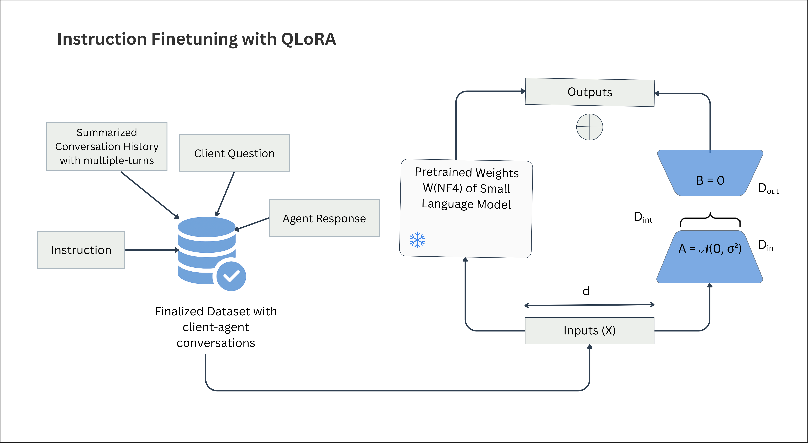

**Parameter-Efficient Fine-Tuning (QLoRA):**
All Small Language Models (SLMs) were adapted using Quantized Low-Rank Adaptation (QLoRA) to enable efficient domain adaptation on constrained hardware.
- **Quantization & Adapters:** 4-bit precision base models with LoRA adapters injected into attention and feed-forward layers (Rank = 16, Alpha = 32, Dropout = 0.1).
- **Training Hyperparameters:** AdamW 8-bit optimizer, learning rate of 2×10⁻⁵ (cosine scheduler), 3 epochs, effective batch size of 16, and a max sequence length of 512 tokens.
- **Framework & Hardware:** Training was conducted using Unsloth and Hugging Face frameworks on a single NVIDIA RTX A100 40GB GPU.

**Inference Configuration:**
Inference was conducted on the full test split (36,669 instances) using a maximum generation length of 128 tokens across all models to ensure concise, customer-service-appropriate responses.
- **SLM Decoding:** Configured based on publisher recommendations for stability. 
- **Commercial LLM Decoding:** API-based inference for GPT-4.1, Gemini-2.5-Flash, and Virtuoso-Large standardized at Temp 0.7 and Top-p 0.9. 
- **Reasoning Constraint:** Gemini-2.5-Flash's explicit reasoning behavior was disabled (thinking budget = 0) to align with the direct instruction-following setup of the SLMs.

## Evaluation Metrics

### Automatic Metrics
- **Lexical**: ROUGE-L, METEOR
- **Semantic**: BERTScore, BARTScore, Cosine Similarity

### Qualitative Assessment
- **LLM-as-a-Judge**: Using Claude Sonnet 4.5
- **Human Evaluation**: 3 independent evaluators
- **Pairwise Comparison**: Using Claude Haiku 4.5

### Evaluation Dimensions
1. Human-Likeness
2. Continuity and Context Understanding
3. Tone and Clarity
4. Task Appropriateness

## Stage-Based Evaluation

A key contribution of this work is the **conversation stage-based evaluation framework** that segments interactions into three distinct phases:

### Conversation Stages
- **Early Stage (10%)**: Issue identification and initial context gathering
- **Mid Stage (80%)**: Core interaction with substantive information exchange — most challenging phase requiring strongest contextual reasoning
- **Late Stage (10%)**: Resolution and closure

### Stage-Based Insights
- **Early Stage**: Top SLMs show moderate competitiveness in issue identification (LLM-as-a-Judge scores: 3.7–3.8)
- **Mid Stage**: Most challenging phase — largest gaps observed in Continuity, Context Understanding and Task Appropriateness; LLaMA-3.1-8B and Qwen-3-8B maintain the strongest SLM performance
- **Late Stage**: SLMs demonstrate their strongest results; LLaMA-3.2-3B-Instruct, Phi-4-Mini and Qwen-3-4B-Instruct exceed Gemini-2.5-Flash under human evaluation (scores above 4.5)

This segmentation enables targeted analysis beyond overall performance scores, identifying which models excel at specific conversation phases.

## Key Results (Summary)

### Quantitative Evaluation (Full Test Set — 36,669 instances)

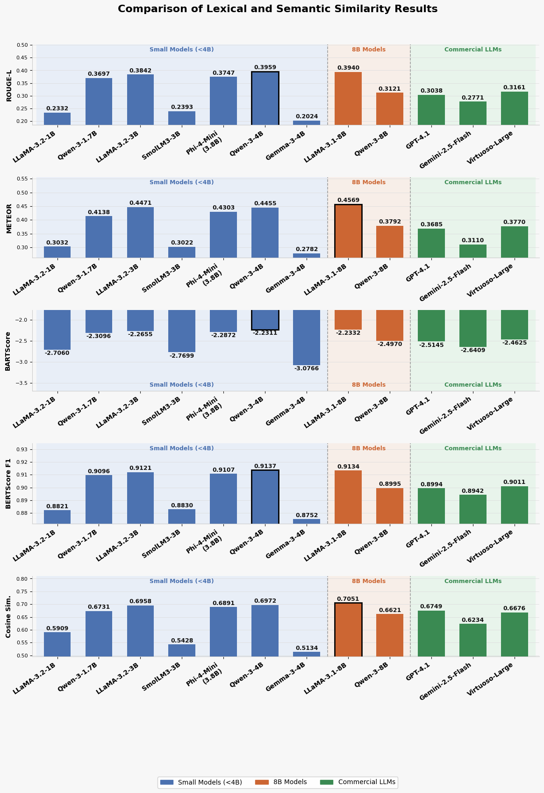

*Comparison of lexical and semantic similarity results on the complete test set. Models are grouped by size: small models (<4B), 8B models, and commercial LLMs.*

Fine-tuned SLMs consistently outperform commercial LLMs on quantitative metrics due to domain-specific fine-tuning alignment with reference responses.

---

### LLM-as-a-Judge Evaluation (Claude Sonnet 4.5 — 6,000 samples per model, 1–5 Likert scale)

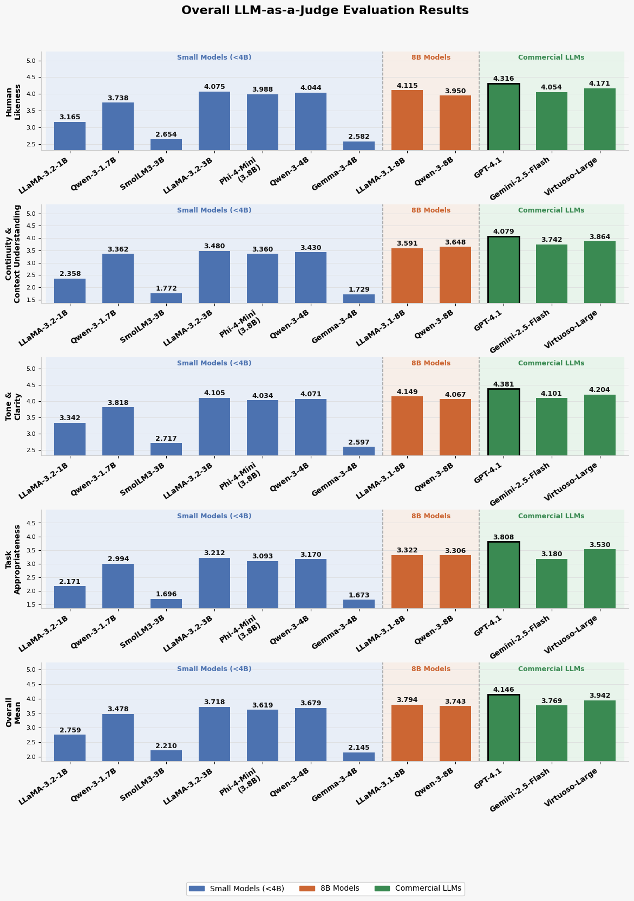

*Overall LLM-as-a-judge evaluation results across four qualitative dimensions using a 5-point Likert scale. Models are grouped by size: small models (<4B), 8B models, and commercial LLMs.*

---

### Human Evaluation (3 Independent Evaluators — 500 samples per model, 1–5 Likert scale)

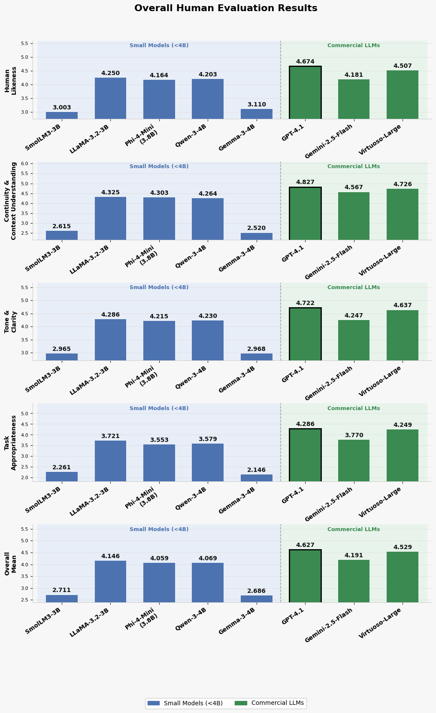

*Overall Human evaluation results across four qualitative dimensions using a 5-point Likert scale.

---

### Pairwise Evaluation (Claude Haiku 4.5 — 1,000 samples)

Selected highlights (SLM win % against commercial LLMs):

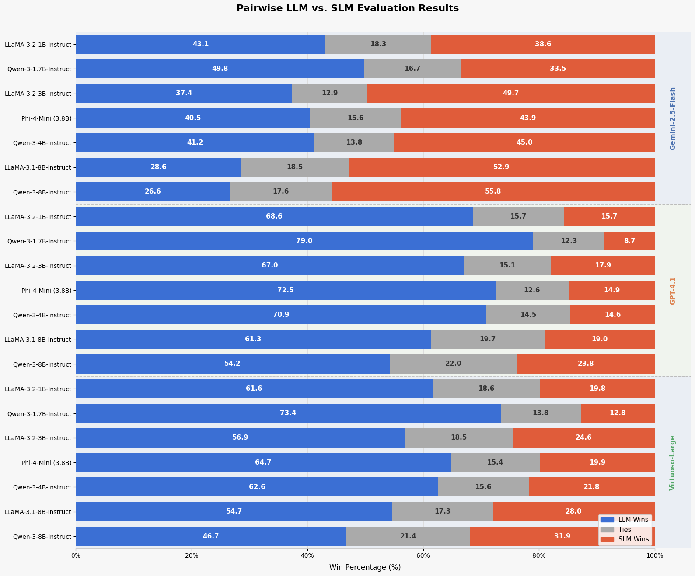

*Pairwise LLM vs. SLM evaluation results expressed as win percentages.*

LLaMA-3.1-8B and Qwen-3-8B both outperform Gemini-2.5-Flash in direct pairwise comparisons. No SLM exceeds GPT-4.1 or Virtuoso-Large in win rate.

---

### Stage-wise Performance Summary (LLM-as-a-Judge Overall Mean)

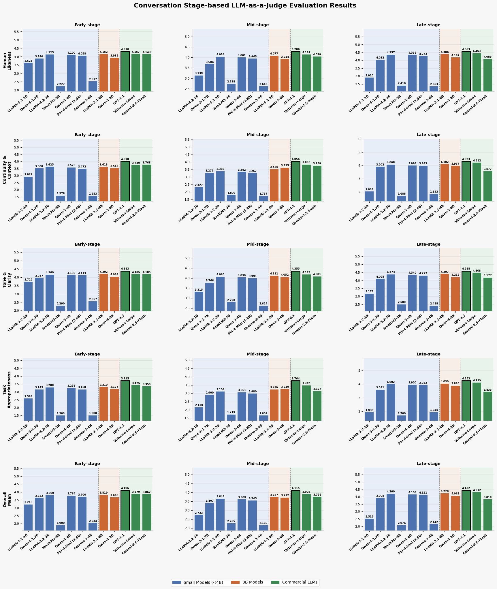

*Stage-wise LLM-as-a-judge evaluation results across early, mid, and late-stage customer-service interactions using a 5-point Likert scale. Scores are averaged over 6,000 evaluation samples, with 600 early-stage, 4,800 mid-stage, and 600 late-stage instances.*

SLMs perform **weakest in Mid-stage** and **strongest in Late-stage** interactions. LLaMA-3.1-8B-Instruct surpasses Gemini-2.5-Flash in Late-stage (4.229 vs 3.818).

---
### Conversation Stage-based Human Evaluation Results

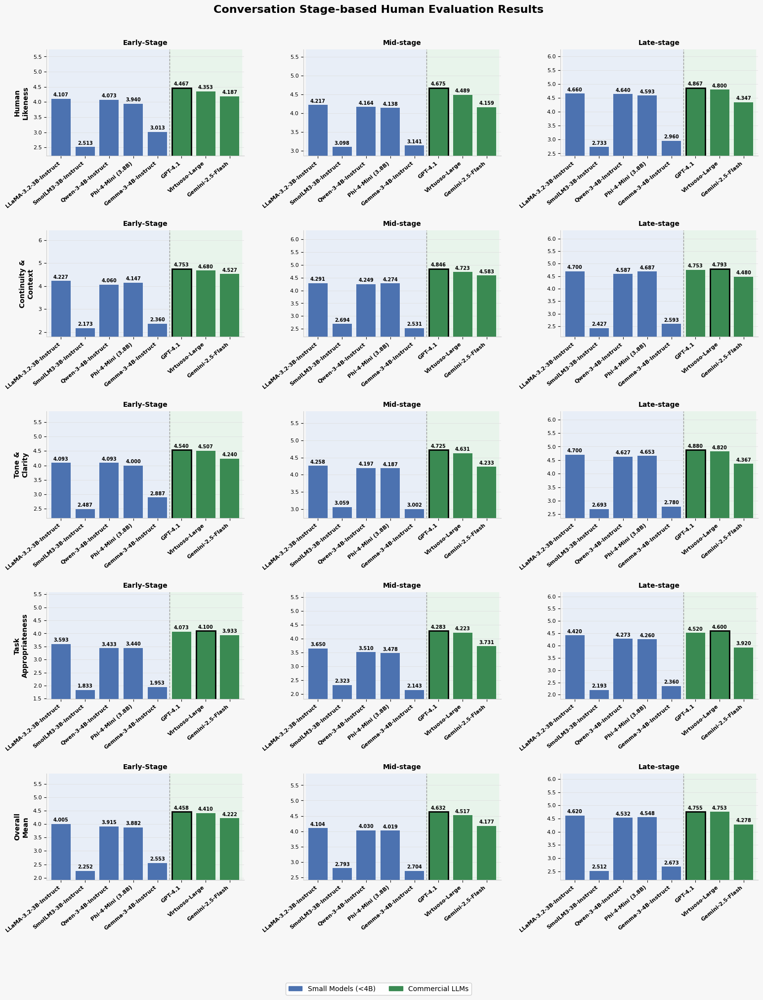

*Stage-wise human evaluation results across early, mid, and late-stage customer-service interactions using a 5-point Likert scale. Scores are averaged over 500 evaluation samples per model, consisting of 50 early-stage, 400 mid-stage, and 50 late-stage instances.*

---

### Conversation Stage-based Pairwise Evaluation Results

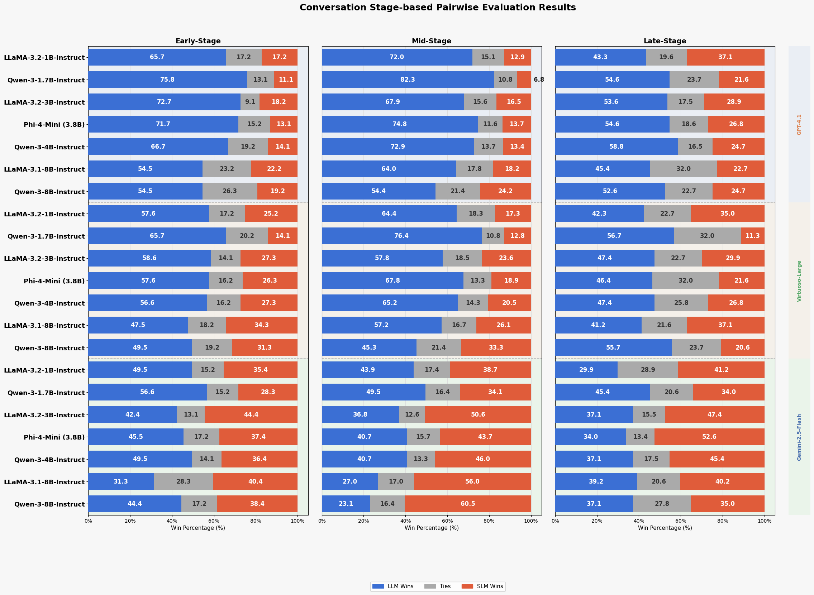

*Win and tie percentages for pairwise comparisons between selected high-performing SLMs and commercial LLMs across Early, Mid, and Late conversation stages, using Claude Haiku 4.5 as the judge.*

---

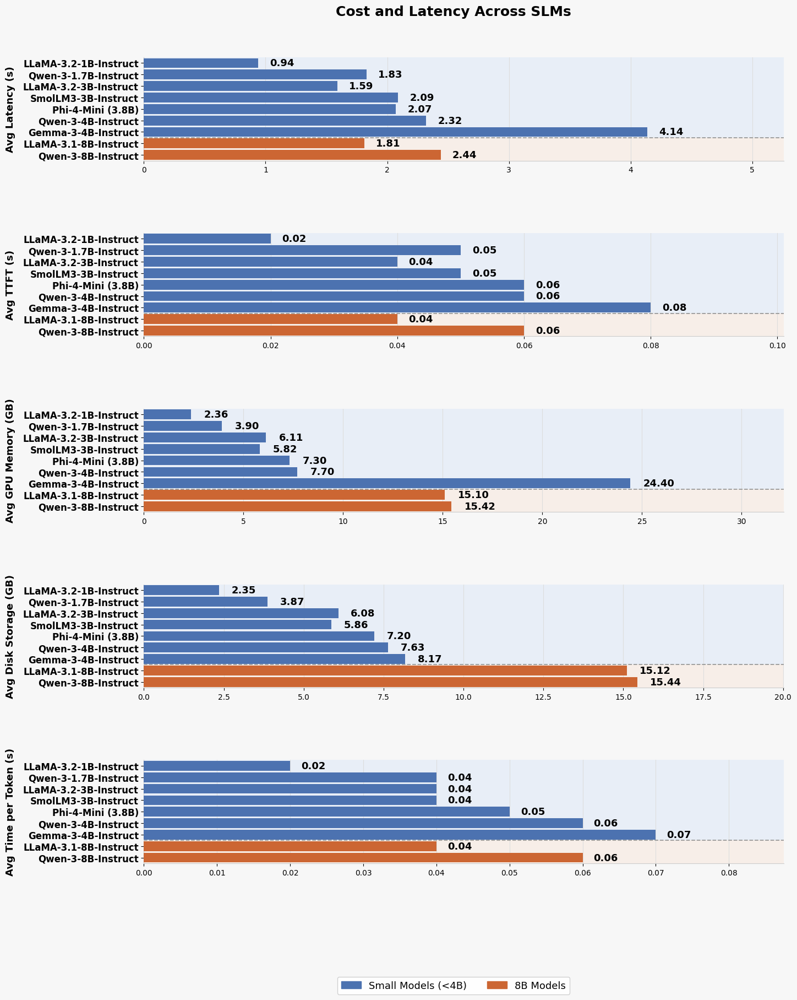

*Inference performance metrics across different model sizes. Models are grouped by size: small models (<4B) and 8B models. Lower values indicate better performance for all metrics.*

## Ablation Study: SLM-based Context Summarization

 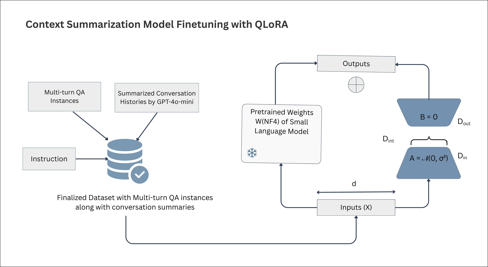

**Goal:** To determine whether fine-tuned SLMs can effectively replace commercial LLMs in generating accurate and coherent context summaries for multi-turn customer service conversations.

**Models Evaluated:** LLaMA-3.1-8B-Instruct, LLaMA-3.2-3B-Instruct, Phi-4-Mini, Qwen-3-4B-Instruct, and Qwen-3-8B-Instruct (evaluated against Gemini-2.5-Flash and GPT-4.1).

**Dataset:**
- Created from a random selection of 50,000 unique conversations from the main multi-turn corpus.
- **Splits:** 35,000 Training (70%), 5,000 Validation (10%), and 10,000 Test (20%).
- **Link:** [Lakshan2003/customer-support-context-summary-50k](https://huggingface.co/datasets/Lakshan2003/customer-support-context-summary-50k)

**Parameter-Efficient Fine-Tuning (QLoRA):**
- **LoRA Configuration:** Adapters applied to query, key, value, and output projection layers (Rank = 8, Alpha = 16, Dropout = 0.1).
- **Hyperparameters:** Max sequence length of 1,024 tokens, AdamW 8-bit optimizer, learning rate of 2×10⁻⁵ (cosine scheduler, warmup 0.05), 3 epochs, and an effective batch size of 16.

**Evaluation Framework:**
- **Quantitative Evaluation (10,000 test instances):** Lexical and semantic overlap assessed using BLEU, METEOR, ROUGE-L, Cosine Similarity, BERTScore F1, and BARTScore.
- **Qualitative Evaluation (1,000 test subset):** LLM-as-a-judge framework using Claude Sonnet 4.5 on a 1–5 Likert scale across three dimensions:
  1. **Information Accuracy:** Correctly capturing key facts (names, accounts, dates, verification steps).
  2. **Structural Clarity:** Logical and clear organization of the client's issue and current status.
  3. **Faithfulness:** Strict adherence to the original conversation without introducing unsupported assumptions.
 
 ### Quantitative Evaluation: Context Summary Generation

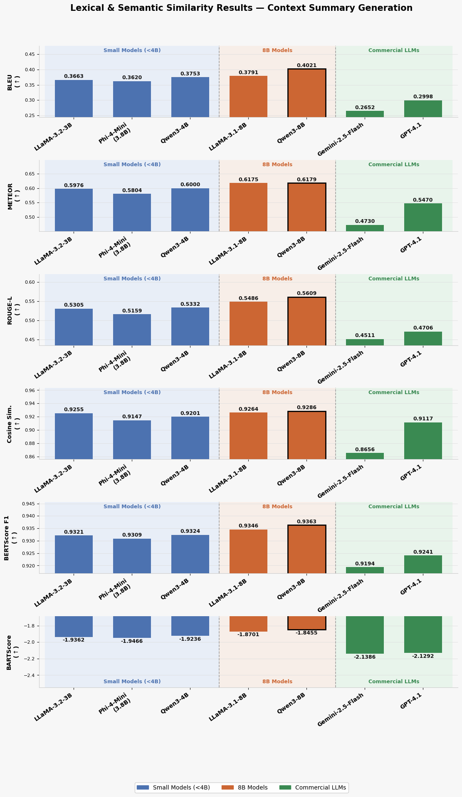

*Lexical and semantic similarity results for context summary generation. Models are grouped by size: small models (<4B), 8B models, and commercial LLMs.*


### Qualitative Evaluation (LLM-as-a-Judge): Context Summary Generation

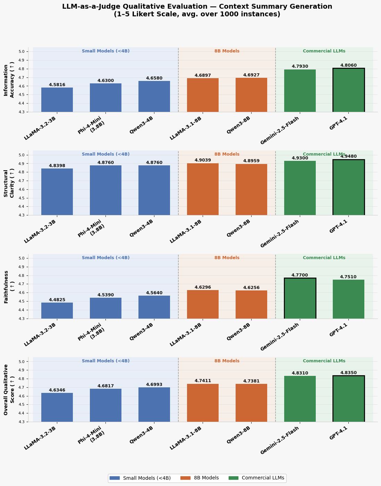

*LLM-as-a-Judge qualitative evaluation results for multi-turn customer service context summarization using a 1–5 Likert scale. Scores represent the average across 1,000 evaluation instances for each model.*

## Experiments, Models and Datasets

All experiments conducted in this study, including fine-tuned models, inference outputs and constructed datasets, are publicly available at the following repository:

Hugging Face: https://huggingface.co/Lakshan2003


## Citation

If you use this work, please cite:

```bibtex
@misc{cooray2026smalllanguagemodelshandle,
      title={Can Small Language Models Handle Context-Summarized Multi-Turn Customer-Service QA? A Synthetic Data-Driven Comparative Evaluation}, 
      author={Lakshan Cooray and Deshan Sumanathilaka and Pattigadapa Venkatesh Raju},
      year={2026},
      eprint={2602.00665},
      archivePrefix={arXiv},
      primaryClass={cs.CL},
      url={https://arxiv.org/abs/2602.00665}, 
}
```

## License

This project is intended for research purposes.For commercial Usage Please contact the author.

## Acknowledgments

We thank the human evaluators and the Zame AI team for supporting API usage for large-scale model inference and evaluation.
