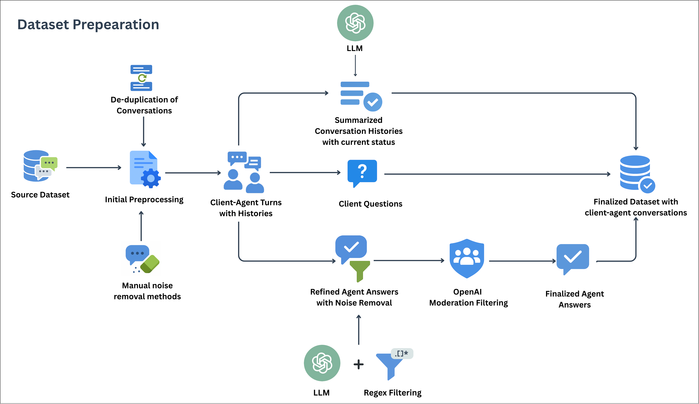

# Small Language Models for Multi-turn Context-Summarized Customer Service QA

This repository contains the code and evaluation framework for research on evaluating Small Language Models for context-summarized multi-turn customer service question answering.

## Overview

This study evaluates instruction-tuned Small Language Models (SLMs) for context-summarized multi-turn customer service question answering. We compare 9 fine-tuned SLMs against 3 commercial LLMs using comprehensive evaluation methods including lexical metrics, semantic similarity, LLM-as-a-judge, and human evaluation.

## Key Features

- **Synthetic Dataset Pipeline**: Transforms single-turn QA into multi-turn conversations with context summarization
- **Comprehensive Evaluation**: Combines automatic metrics with qualitative assessments (lexical, semantic, LLM-as-a-judge, human evaluation)
- **Stage-Based Evaluation Framework**: Novel conversation stage segmentation (Early/Mid/Late) to analyze model behavior across different phases of customer service interactions
- **Fine-Tuning Framework**: QLoRA-based parameter-efficient fine-tuning for SLMs

## Models Evaluated

### Small Language Models (SLMs)
- LLaMA-3.2-1B, 3B-Instruct and LLaMA-3.1-8B-Instruct
- Qwen-3-1.7B, 4B, and 8B-Instruct
- Phi-4-Mini (3.8B)
- Gemma-3-4B-Instruct
- SmolLM3-3B-Instruct

### Commercial LLMs (Baseline)
- GPT-4.1
- Gemini-2.5-Flash
- Virtuoso-Large

## Repository Structure

```
├── ContextSummarizationAblationStudy/
│   ├── ContextSummarizationModelEvaluation/
│   │   ├── Llama-3.1_8B_evaluation.ipynb
│   │   ├── Llama-3.2_3B_evaluation.ipynb
│   │   ├── Phi-4-mini_evaluation.ipynb
│   │   ├── Qwen-3-4B_evaluation.ipynb
│   │   ├── Qwen-3-8B_evaluation.ipynb
│   │   ├── context_summarization_evaluation_results.ipynb
│   │   ├── context_summary_llm_judge.ipynb
│   │   ├── gemini_evaluation.ipynb
│   │   └── gpt4.1_evaluation.ipynb
│   ├── ContextSummarizationModelTraining/
│   │   ├── Llama-3.1-8B-Instruct-model.ipynb
│   │   ├── Phi-4-mini-instruct.ipynb
│   │   ├── Qwen-3-4B-model-Instruct.ipynb
│   │   ├── Qwen-3-8B-Instruct-model.ipynb
│   │   └── llama-3.2-3B-Instruct-model.ipynb
│   └── ContextSummarizationDataset.ipynb
│
├── DatasetCreation/
│   ├── CustomerSupportDataset.ipynb
│   └── context-summary-generation.ipynb
│
├── InferenceCostBenchmark/
│   ├── Llama32_1b_benchmark.ipynb
│   ├── Llama_31_8b_instruct_benchmark.ipynb
│   ├── Llama_32_3b_instruct_benchmark.ipynb
│   ├── create_test_dataset.ipynb
│   ├── gemma_3_4b_instruct_benchmark.ipynb
│   ├── phi_4_mini_benchmark.ipynb
│   ├── qwen3_17b_instruct_benchmark.ipynb
│   ├── qwen3_4b_instruct_benchmark.ipynb
│   ├── qwen3_8b_instruct_benchmark.ipynb
│   └── smollm3_3b_instruct_benchmark.ipynb
│
├── ModelDecodingEvaluation/
│   ├── Gemma3-4B-instruct_evaluation.ipynb
│   ├── Llama-3.1_8B_evaluation.ipynb
│   ├── Llama-3.2_1B_evaluation.ipynb
│   ├── Llama-3.2_3B_evaluation.ipynb
│   ├── Phi-4-mini_evaluation.ipynb
│   ├── Qwen-3-1.7B_evaluation.ipynb
│   ├── Qwen-3-4B_evaluation.ipynb
│   ├── Qwen-3-8B_evaluation.ipynb
│   ├── SmolLM3-3B_evaluation.ipynb
│   ├── gemini_evaluation.ipynb
│   ├── gpt4.1_evaluation.ipynb
│   └── virtuoso_large_evaluation.ipynb
│
├── OverallEvaluationResults/
│   ├── EvaluationPlots.ipynb
│   ├── HumanEvaluation.ipynb
│   ├── PairwiseEvaluation.ipynb
│   └── judge_semantic_lexical_results.ipynb
│
├── SLMsFinetuning/
│   ├── Gemma3-4B-instruct-model.ipynb
│   ├── Llama-3.1-8B-Instruct-model.ipynb
│   ├── Phi-4-mini-instruct.ipynb
│   ├── Qwen-3-1.7B-model-Instruct.ipynb
│   ├── Qwen-3-4B-model-Instruct.ipynb
│   ├── Qwen-3-8B-Instruct-model.ipynb
│   ├── SmolLM3-3B-Instruct.ipynb
│   ├── llama-3.2-1B-Instruct-model.ipynb
│   └── llama-3.2-3B-Instruct-model.ipynb
│
├── LICENSE
└── README.md
```

## Dataset

The synthetic dataset is constructed from the Hugging Face TalkMap Customer Service Banking Conversation Corpus.



**Construction Pipeline:**
1. **Preprocessing and Filtering:** Retained conversations ranging from 5 to 100 turns to ensure realistic dialogue depth and applied Regex-based noise removal.
2. **Multi-Turn Construction:** Aggregated sequential single turns into complete dialogues, applied de-duplication, and partitioned conversations into early (20%), middle (70%), and late (10%) segments.
3. **Context Summarization:** Summarized prior conversational histories using GPT-4o-mini to condense token length while preserving essential facts, names, and verification steps.
4. **Response Refinement & Moderation:** Enhanced agent answers for naturalness, clarity, and contextual coherence using GPT-4.1, followed by safety filtering using OpenAI’s Moderation API.
5. **Structured Instance Formation:** Assembled standard QA instances (instruction, summarized history, current query, refined response) and divided them into standard splits.

 The created dataset is publicly available at: [Lakshan2003/customer-support-client-agent-conversations](https://huggingface.co/datasets/Lakshan2003/customer-support-client-agent-conversations).

 ## Model Training & Inference

 

**Parameter-Efficient Fine-Tuning (QLoRA):**
All Small Language Models (SLMs) were adapted using Quantized Low-Rank Adaptation (QLoRA) to enable efficient domain adaptation on constrained hardware.
- **Quantization & Adapters:** 4-bit precision base models with LoRA adapters injected into attention and feed-forward layers (Rank = 16, Alpha = 32, Dropout = 0.1).
- **Training Hyperparameters:** AdamW 8-bit optimizer, learning rate of 2×10⁻⁵ (cosine scheduler), 3 epochs, effective batch size of 16, and a max sequence length of 512 tokens.
- **Framework & Hardware:** Training was conducted using Unsloth and Hugging Face frameworks on a single NVIDIA RTX A100 40GB GPU.

**Inference Configuration:**
Inference was conducted on the full test split (36,669 instances) using a maximum generation length of 128 tokens across all models to ensure concise, customer-service-appropriate responses.
- **SLM Decoding:** Configured based on publisher recommendations for stability. 
- **Commercial LLM Decoding:** API-based inference for GPT-4.1, Gemini-2.5-Flash, and Virtuoso-Large standardized at Temp 0.7 and Top-p 0.9. 
- **Reasoning Constraint:** Gemini-2.5-Flash's explicit reasoning behavior was disabled (thinking budget = 0) to align with the direct instruction-following setup of the SLMs.

## Key Results (Summary)

### Quantitative Evaluation (Full Test Set — 36,669 instances)

| Model | ROUGE-L | METEOR | BARTScore | BERTScore F1 | Cosine Sim. |
|---|---|---|---|---|---|
| **Qwen-3-4B-Instruct** | **0.3959** | 0.4455 | **-2.2311** | **0.9137** | 0.6972 |
| LLaMA-3.2-3B-Instruct | 0.3842 | 0.4471 | -2.2655 | 0.9121 | 0.6958 |
| **LLaMA-3.1-8B-Instruct** | 0.3940 | **0.4569** | -2.2332 | 0.9134 | **0.7051** |
| Phi-4-Mini (3.8B) | 0.3747 | 0.4303 | -2.2872 | 0.9107 | 0.6891 |
| GPT-4.1 | 0.3038 | 0.3685 | -2.5145 | 0.8994 | 0.6749 |
| Gemini-2.5-Flash | 0.2771 | 0.3110 | -2.6409 | 0.8942 | 0.6234 |
| Virtuoso-Large | 0.3161 | 0.3770 | -2.4625 | 0.9011 | 0.6676 |

Fine-tuned SLMs consistently outperform commercial LLMs on quantitative metrics due to domain-specific fine-tuning alignment with reference responses.

---

### LLM-as-a-Judge Evaluation (Claude Sonnet 4.5 — 6,000 samples per model, 1–5 Likert scale)

| Model | Human-Likeness | Continuity & Context | Tone & Clarity | Task Appropriateness | Overall Mean |
|---|---|---|---|---|---|
| **GPT-4.1** | **4.316** | **4.079** | **4.381** | **3.808** | **4.146** |
| Virtuoso-Large | 4.171 | 3.864 | 4.204 | 3.530 | 3.942 |
| Gemini-2.5-Flash | 4.054 | 3.742 | 4.101 | 3.180 | 3.769 |
| LLaMA-3.1-8B-Instruct | 4.115 | 3.591 | 4.149 | 3.322 | 3.794 |
| Qwen-3-8B-Instruct | 3.950 | 3.648 | 4.067 | 3.306 | 3.743 |
| LLaMA-3.2-3B-Instruct | 4.075 | 3.480 | 4.105 | 3.212 | 3.718 |
| Qwen-3-4B-Instruct | 4.044 | 3.430 | 4.071 | 3.170 | 3.679 |
| Phi-4-Mini (3.8B) | 3.988 | 3.360 | 4.034 | 3.093 | 3.619 |

---

### Human Evaluation (3 Independent Evaluators — 500 samples per model, 1–5 Likert scale)

| Model | Human-Likeness | Continuity & Context | Tone & Clarity | Task Appropriateness | Overall Mean |
|---|---|---|---|---|---|
| **GPT-4.1** | **4.674** | **4.827** | **4.722** | **4.286** | **4.627** |
| Virtuoso-Large | 4.507 | 4.726 | 4.637 | 4.249 | 4.529 |
| Gemini-2.5-Flash | 4.181 | 4.567 | 4.247 | 3.770 | 4.191 |
| LLaMA-3.2-3B-Instruct | 4.250 | 4.325 | 4.286 | 3.721 | 4.146 |
| Qwen-3-4B-Instruct | 4.203 | 4.264 | 4.230 | 3.579 | 4.069 |
| Phi-4-Mini (3.8B) | 4.164 | 4.303 | 4.215 | 3.553 | 4.059 |

---

### Pairwise Evaluation (Claude Haiku 4.5 — 1,000 samples)

Selected highlights (SLM win % against commercial LLMs):

| SLM | vs Gemini-2.5-Flash | vs GPT-4.1 | vs Virtuoso-Large |
|---|---|---|---|
| LLaMA-3.1-8B-Instruct | **52.9%** | 19.0% | 28.0% |
| Qwen-3-8B-Instruct | **55.8%** | 23.8% | 31.9% |
| LLaMA-3.2-3B-Instruct | 49.7% | 17.9% | 24.6% |
| Qwen-3-4B-Instruct | 45.0% | 14.6% | 21.8% |
| Phi-4-Mini (3.8B) | 43.9% | 14.9% | 19.9% |

LLaMA-3.1-8B and Qwen-3-8B both outperform Gemini-2.5-Flash in direct pairwise comparisons. No SLM exceeds GPT-4.1 or Virtuoso-Large in win rate.

---

### Stage-wise Performance Summary (LLM-as-a-Judge Overall Mean)

| Model | Early-Stage | Mid-Stage | Late-Stage |
|---|---|---|---|
| GPT-4.1 | 4.106 | 4.115 | **4.432** |
| LLaMA-3.1-8B-Instruct | 3.819 | 3.737 | 4.229 |
| LLaMA-3.2-3B-Instruct | 3.800 | 3.648 | 4.200 |
| Qwen-3-4B-Instruct | 3.764 | 3.609 | 4.154 |
| Phi-4-Mini | 3.700 | 3.545 | 4.121 |
| Gemini-2.5-Flash | 3.862 | 3.752 | 3.818 |

SLMs perform **weakest in Mid-stage** and **strongest in Late-stage** interactions. LLaMA-3.1-8B-Instruct surpasses Gemini-2.5-Flash in Late-stage (4.229 vs 3.818).

---

### Inference Efficiency (NVIDIA A100 — 1,000 test instances)

| Model | Avg Latency (s) | Avg TTFT (s) | GPU Memory (GB) | Disk (GB) |
|---|---|---|---|---|
| LLaMA-3.2-1B-Instruct | **0.94** | **0.02** | **2.36** | 2.35 |
| LLaMA-3.2-3B-Instruct | 1.59 | 0.04 | 6.11 | 6.08 |
| LLaMA-3.1-8B-Instruct | 1.81 | 0.04 | 15.10 | 15.12 |
| Phi-4-Mini | 2.07 | 0.06 | 7.30 | 7.20 |
| Qwen-3-4B-Instruct | 2.32 | 0.06 | 7.70 | 7.63 |
| Gemma-3-4B-Instruct | 4.14 | 0.08 | 24.40 | 8.17 |

LLaMA-3.2-3B-Instruct offers the best balance of conversational quality and efficiency among <4B models (1.59s latency, 6.11GB GPU memory).


## Dataset

The dataset is constructed from the Customer Service Banking Conversation Corpus, processed through:
1. Multi-turn conversation construction
2. Context summarization using GPT-4o-mini
3. Response refinement using GPT-4.1
4. Content moderation filtering

**Dataset Statistics:**
- Training: 128,335 samples
- Validation: 18,333 samples  
- Test: 36,669 samples
- Average turns per conversation: ~10

## Evaluation Metrics

### Automatic Metrics
- **Lexical**: ROUGE-L, METEOR
- **Semantic**: BERTScore, BARTScore, Cosine Similarity

### Qualitative Assessment
- **LLM-as-a-Judge**: Using Claude Sonnet 4.5
- **Human Evaluation**: 3 independent evaluators
- **Pairwise Comparison**: Using Claude Haiku 4.5

### Evaluation Dimensions
1. Human-Likeness
2. Continuity and Context Understanding
3. Tone and Clarity
4. Task Appropriateness

## Stage-Based Evaluation

A key contribution of this work is the **conversation stage-based evaluation framework** that segments interactions into three distinct phases:

### Conversation Stages
- **Early Stage (10%)**: Issue identification and initial context gathering
- **Mid Stage (80%)**: Core interaction with substantive information exchange — most challenging phase requiring strongest contextual reasoning
- **Late Stage (10%)**: Resolution and closure

### Stage-Based Insights
- **Early Stage**: Top SLMs show moderate competitiveness in issue identification (LLM-as-a-Judge scores: 3.7–3.8)
- **Mid Stage**: Most challenging phase — largest gaps observed in Continuity, Context Understanding and Task Appropriateness; LLaMA-3.1-8B and Qwen-3-8B maintain the strongest SLM performance
- **Late Stage**: SLMs demonstrate their strongest results; LLaMA-3.2-3B-Instruct, Phi-4-Mini and Qwen-3-4B-Instruct exceed Gemini-2.5-Flash under human evaluation (scores above 4.5)

This segmentation enables targeted analysis beyond overall performance scores, identifying which models excel at specific conversation phases.

## Training Configuration

- **Method**: QLoRA (4-bit quantization + LoRA)
- **LoRA Rank**: 16, Alpha: 32, Dropout: 0.1
- **Optimizer**: AdamW 8-bit
- **Learning Rate**: 2×10⁻⁵
- **Epochs**: 3
- **Max Sequence Length**: 512 tokens
- **Hardware**: NVIDIA RTX A100 40GB

## Citation

If you use this work, please cite:

```bibtex
@misc{cooray2026smalllanguagemodelshandle,
      title={Can Small Language Models Handle Context-Summarized Multi-Turn Customer-Service QA? A Synthetic Data-Driven Comparative Evaluation}, 
      author={Lakshan Cooray and Deshan Sumanathilaka and Pattigadapa Venkatesh Raju},
      year={2026},
      eprint={2602.00665},
      archivePrefix={arXiv},
      primaryClass={cs.CL},
      url={https://arxiv.org/abs/2602.00665}, 
}
```

## License

This project is intended for research purposes.

## Acknowledgments

We thank the human evaluators and the funding team for supporting API usage for large-scale model inference and evaluation.
